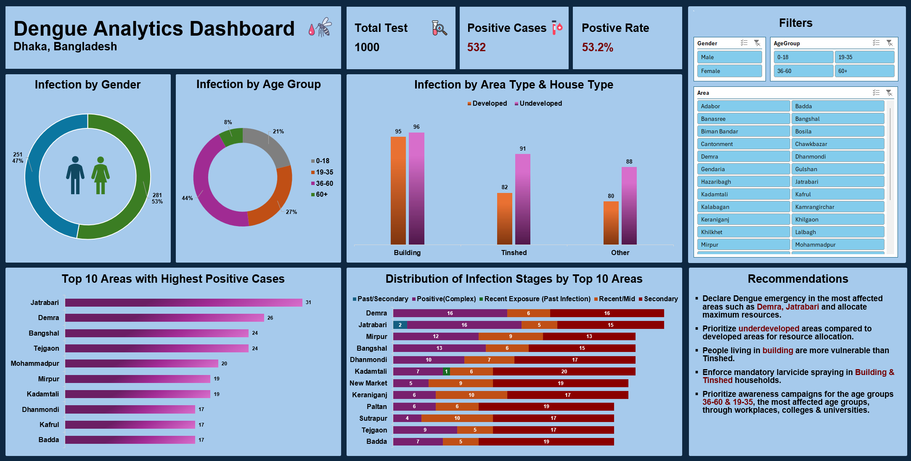

# 🦟 Data Analysis & Interactive Dashboard 📊

**Project Title:** Dengue Outbreak Data Analysis & Interactive Dashboard in Excel
📍 **Region:** Dhaka, Bangladesh  
🗂️ **Files Included:**
- `DengueAnalyticsDashboard.xlsx` – Fully interactive Excel dashboard
- `Dengue Dataset Description.txt` - Description of this dataset
- `DengueAnalyticsDashboardExcel-ss.png` – Screenshot of the Dashboard
- `README.md` – Project overview and documentation

## 🔍 Overview
Real survey data of dengue infection cases from the Dhaka region of Bangladesh is used for Data Analysis and Dashboard building. First, Exploratory Data Analysis (EDA) is performed to understand the data, anomaly detection etc. This project includes PivotTable, Chart, Statistical Analysis and Dashboard. Using the interactive dashboard, public health actions have been recommended.

## 📅 About the Dataset
Data from a 1000-person survey in Dhaka, Bangladesh, including NS1, IgG, IgM markers, demographics, and outcomes.

## 📌 Tools/Feature used from Excel
- Table, Filter, Formulas, Pivot Tables, Slicer, Charts (Doughnut, Bar & Column), Statistical Analysis (Descriptive Statistics)

## 📌 Key Features
- Infection stage classification (Acute, Positive, Secondary etc. using NS1, IgM, IgG).
- Distribution of Dengue cases by Area-type & house-type.
- Infection case analysis by Age group & gender.
- Pivot-table driven Charts.
- Statistical Analysis.
- KPIs for decision making.
- Created interactive Excel dashboard with filtering.
- Developed actionable insights for public health intervention.

## 📌 Key Findings
→ Identified geographic hotspots requiring immediate intervention.
→ Indentified the most effected age groups.
→ Discovered most effected segments by comparing House & Area type.
→ Created 5 actionable recommendations for officials such as City Corporation or Health Ministry.

## 🖼️ Dashboard Preview

📄 [Excel Dashboard File](DengueAnalyticsDashboard.xlsx)
